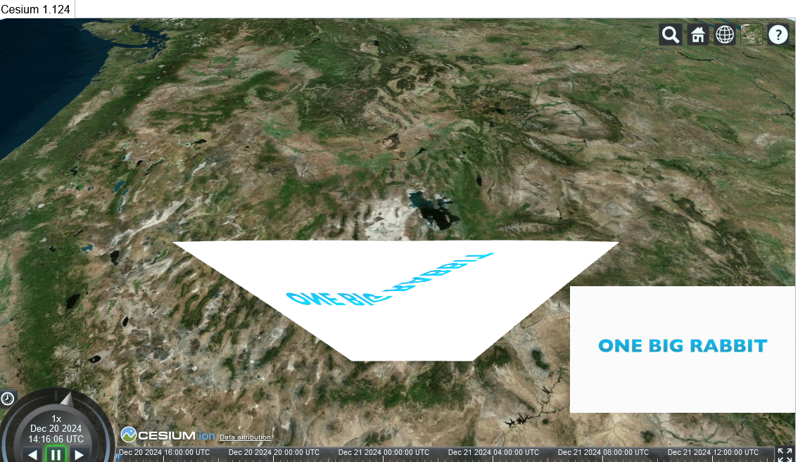

# Виконання практичного завдання від 

### Завдання:
Відео проекція на земну поверхню в GIS (Google Maps, Cesium, що-небудь ще)
1. Необхідно проеціювати відео з камери на 3D-поверхню у будь-якому картографічному движку. Так, щоб положення об'єктів на камері збігалося з положенням об'єктів на проекції
2. Приблизний приклад: https://remotegeo.com/wp-content/uploads/2020/12/Press-Release-LineVision-Online-DJI-Drone-FOV-FMV-Video-Support-768x240.jpg
3. Ще приклад https://www.youtube.com/watch?v=CUvnI9Yphe4&pp=ygUbdmlkZW8gcHJvamVjdGlvbiBvbiB0ZXJyYWlu
4. Бажано використовувати двигун Cesium, але влаштує будь-яке інше рішення.
5. Вхідні дані - координати камери (Lat, Lon, Alt) та три кути повороту. Потрібно буде обчислити область перетину області видимості камери з поверхнею і натягнути (спроектувати з урахуванням рельєфу) потім на поверхню зображення (для початку просто фото)

### Результат виконання:
Через значні проблеми під час розробки, було створено 2 частини додатку: додаток для відстежування польоту (`flightpath.html`) та не закінчений додаток для зображення проєкції камери дрона на поверхні (`shadow_try.html`).

### Знайдені проблеми:
Під час розробки стало зрозуміло, що накладені на поверхню землі полігони повдяться не так, як звичайні полігони. Їх текстура накладається відповідно до землі, і це не можна змінити будь-яким способом. Ця проблема відстежується ще з 2016 року на [офіційному репозиторії Цезіуму](https://github.com/CesiumGS/cesium/issues/4164). Схоже, що це питання, хоч і з високим пріорітетом, але все ж було відкладено на майбутнє.

Накладений на поверхню полігон:[посилання](https://sandcastle.cesium.com/index.html#c=tVZtb9s2EP4rRIYhNuDoxZLllzjB0jQN2jVr0GRpt7ooaOkiEaVElaSSaoP/+44SbctGuu7DKr+IPN5zdzzeQ9J1yU0mHhV5YAkIQouEsJymQDR81ZUEIgpSCl6nolgUrmt+5FqKJYd8RqoHEgshE0VopQVJoQBJNSREiQ2e4SB/pLUihZA6I1XZ3xh6B6QAVEfsEghFo6apQBOdgbWOxsV907dhoMqsQePjDbwB8ds/H3s+aUZYoTTQxAJzNM6KtIlxE+ICp/NAJU4bHkGSEwzkkZyDYlXu3DWy3uIgbvrnotCUIW5xMCB/LwqCc5MSJbM14LbtO/dS5O+E5IkV9PqDRbHqH2+dYY4vMHVQaHSZiLgyTScFbaXP6pdJ71AjmIM83CJtNpNrm4MTG7iDGKYZKIcmSa8JjmCiFMpQaxPgOZUaW7QImhifQyoBVG88HZAAf77neSZUAy5oDgg8XGcbv6qS9zSGw8HafDsyI9afeTKGeZVxVu+Ku+Go78Vzhkmrex920eY58v2hM/KjaRRM/aHne74JfOyMomEwmfjROIq8UTD4JjBEjRDxk8ALLTBCI5Mg8IfTaPRtYOBNg2k4CaJwGFlggCGMvckonIbDf0GGQ7TthdNJNBpbpB/5k3AaRFE09ndxH/t7hh4A8/P1hZA51dusmcXnWIjnggt5VpZAJS1icO4u3t5evP/04s3bq7PbraHVgGw7toDODV1ZgQxQuE5IlVtL03g7QGjTz0vgoHlNWIrMNYzZW84Z6SxVhz6bxR32DDG7c3tay/+vWt73tbw9rXXr406GV50ephgkoxzz3OVnq7Da8rflG1Iz/gzJhaFdjTTcI2ajeoO7aEyV5mBYeSsEX1J5BUXV+4DUWOiFNijk2F2z59olMPQyY5hZTHyM4/dVEZtM9/rE4lpkx59jyehsZnGyM4vjFrcyr1XjYDeCl81e/39H0FmaxsGVHcKDo8TKrnsbYwvdnDYYSaZ1OXPd0FmWzpKLVJVCO1iF7lEYHGWvXl3n0eXEvfv13NOXyZ835Uv3zD6e+N2dZr9dvb+MvrxOY1f5kee5dwx37RR+Hj5LGU8gMQ3BzeseSVObt8StrnmDeZXSIPAMwnbP7ztlka4TYj6UlxmdEc8ZrWVtYWyyuyg+9o8PBgdzpWsOp+sC+4XlJR58pJK85ziuhrzkhmXussJCwikq1RZYq/6T3fu7m+iacTM8IpXglYbj7eBSaC3wLB6Pyq8dsWRphgvodUSPLNHZjARDb0czg1bVn3Tlq7Yxd9ezsf2EPRCWnDxxNpKYU6Vw5L7i/Ib9BYuD07mL+qf7UC4objXpG9zlOK2NWuafvm6FjuPMXew+jdQtlzqWrUZ7e2l12gRiQDlmykiwac5+zHvd9rgQZduKpVBKYLJYYQU4ISm4anqbRZwrUckYiJIxDphSVVirbQqaIi2rJWexu2X+DcV1hudUU3fJ0iOz2PhXFPUnG5/zCMscHeq6BLTZTMBtZT/UbV6G+14b0Y91Kh72nX6pWPwZ2Q8d13+gZ7KUeB1FAiQCzJ1R4/WjbBhk7oDzWCRw2liYu02bQLvTOeuCbQatyX8A)

Звичайний полігон: [посилання](https://sandcastle.cesium.com/index.html#c=tVRta9tIEP4rg+5DbXBWdpzQILuhPbfQg0ALKQdHVcJ6NZH2utKouys7asl/70q7spW05XIfarA0L8/M7D4zI0GVsbCTuEcNL6DCPWzQyKZkf/e2SRqJXt9QZbmsUKfRdJVWabXj2sVlSG8UllhZF52RaDqR5WiD9c/2r2zyzGouFepnPlL0NS3e2UZj9p5Um1Plwv0pmIuSVqJhPMsm39IKoOIlJp0AkEZv7qxuMswOCaAOGfbSFlCjPqnJuAzOUqDMC2uAVxmIxlgqhygQRDqTFbdo0mjWJQ9pEvjmSxUSNdeiaJOBkg3XDi55tWS3msrXmGtE80pr3r71lSYffSzAyWJxwc5mg3o2Hynnc/c7aB10+Svo8gH0ZDH/H0lP2VFfXvwy5eKMnY5w46DzI/LTNAiBwM2RvwNjHYeeeWc7MAHjqTpQeDqZz2Axnf0nil08Cbd4Kmr+hJqPUIP0Kdjuw9vN2vtwYd//BG65MhjcGCZ18A1Ulo40LblKHuzPDOI4jRiLZclzNLE/1s0V5XSzIUWa/VvnYVS7A9z7ZXKL6NfmK1H5gSaPlmi6gmgWpdGqCxv+AGtjW4WXw8VeyrImbaHRauJOYLGsVdfZeNuIz2iZMGa6GsDD+4+w1cfuH/ufAN8aUo3F1dG5Jes2MIHn5/XdyKwDOyPTXma2SGB5On+ALAKRi4ux/T5cKR7faZ3JHcjsxU8+XyAUN8Z5bhulruVXTKPLdezwP4Qq4m7E83c71Iq3HaxYXF55I2NsHTv155GWSG25HmVe970OXk+cO0rpGOosTuSNJcd66zVFVHtJaDKGHEmyCgZ3FU3K9NqhhWtDjRYIRgvnKKytTRLH/vJMUBnXzVZJEV+7b6Hgxiq85q7L+JpbHm9lftK12j2qqr0J52N73JauoG1rdDn7C8Te9lvLlvXZ46q96fcWpd3jol8aKT5bWeKo9D+uMmw17Y0b/IzQQEUWTFP3+2MLhLWgDC/7DOu4lwH9hrNhUHtnSOmf3wE)

### Додатки самодостатні, потрібен лише сервер для їх роботи. Також у додатках треба ввести токен до власного Cesium Ion => Cesium.Ion.defaultAccessToken
